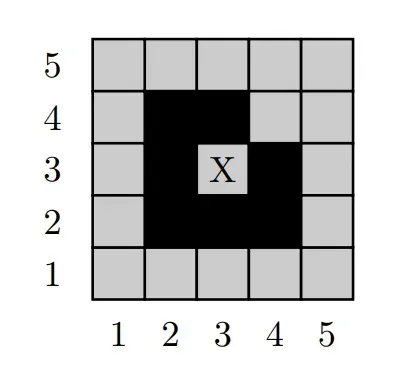
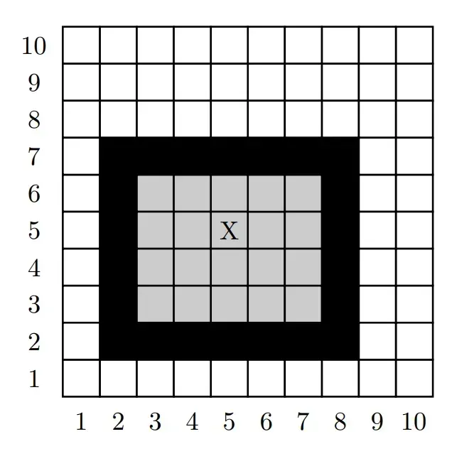

# [Colorindo](https://neps.academy/br/exercise/535)
A Sociedade Brasileira das Cores (SBC) é uma editora de livros de colorir. As crianças adoram os livros da SBC porque suas figuras, depois de pintadas, ficam muito coloridas e bonitas. Isso acontece porque a SBC se preocupa em não deixar grandes regiões contínuas em suas figuras, que devem ser pintadas com uma cor só. Até agora, o processo de verificar se uma figura tinha uma região contínua grande era completamente visual, mas a SBC resolveu automatizar esse processo e você foi contratado para programar uma parte desse sistema.

Uma figura é representada por uma grade, de dimensão N por M. Cada quadrado dessa grade é representado por uma coordenada (i,j), com 1≤i≤N e 1≤j≤M. Por exemplo, a coordenada (1, 5) representa o quadrado na primeira linha e quinta coluna, enquanto que a coordenada (3, 7) representa o quadrado na terceira linha e sétima coluna. As linhas são contadas de baixo para cima e as colunas da esquerda para a direita.

Cada quadrado pode estar vazio ou cheio. Assumimos que uma criança só vai pintar sobre quadrados vazios e se ela pintar um quadrado de uma cor, ela irá pintar os oito vizinhos da mesma cor, desde que eles estejam vazios e que ela não saia da área da figura.

Dada a figura e a coordenada onde uma criança vai começar a pintar, sua tarefa é descobrir quantos quadrados ela irá pintar.

## Entrada
A primeira linha da entrada contém 5 números inteiros, N, M, X, Y e K. Os números inteiros N e M são respectivamente o número de linhas e colunas da grade, enquanto que (X,Y) é a coordenada onde a criança vai começar a pintar e K é o número de quadrados cheios na figura.

Seguem-se K linhas, cada uma com dois inteiros A e B, que são as coordenadas de um quadrado cheio.

Garantimos que o quadrado na posição (X,Y) está sempre vazio.

## Saída
Seu programa deve imprimir uma linha contendo o número de quadrados pintados pela criança.

## Explicação dos Exemplos
No segundo exemplo temos uma figura de dimensões 5 × 5. A criança começa a pintar na posição (3, 3). Na figura abaixo ilustramos este caso. A posição que a criança inicia está marcada com a letra X, e os quadrados que a criança consegue pintar estão destacados em cinza claro. Note que ela consegue pintar o quadrado (4, 4), pois este quadrado é um dos quadrados que ela consegue pintar após ter pintado o quadrado (3, 3).

No terceiro exemplo temos uma figura de dimensões 10×10. A criança começa a pintar na posição (5, 5). Na figura abaixo ilustramos este caso. A posição que a criança inicia está marcada com a letra X, e os quadrados que a criança consegue pintar estão destacados em cinza claro.

### Exemplos de Entrada
1 5 1 2 2

1 1

1 4

### Exemplos de Saída
2

### Exemplos de Entrada
5 5 3 3 7

2 2

2 3

2 4

3 2

3 4

4 2

4 3

### Exemplos de Saída
18

### Exemplos de Entrada
10 10 5 5 22

2 2

2 3

2 4

2 5

2 6

2 7

2 8

3 2

3 8

4 2

4 8

5 2

5 8

6 2

6 8

7 2

7 3

7 4

7 5

7 6

7 7

7 8

### Exemplos de Saída
20

